<div align="center">

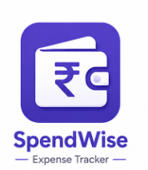

# SpendWise — Expense Tracker

**Track your money. Own your finances.**

[](https://flutter.dev)
[](https://dart.dev)
[](https://pub.dev/packages/provider)
[](https://pub.dev/packages/get_storage)
[](https://flutter.dev)

<br/>

> A clean, offline-first personal finance app built with Flutter.  
> Log transactions, visualize spending patterns, and take control of your budget — no internet required.

</div>

---

## 📸 Screenshots

<h3 align="center">Splash & Home</h3>

<p align="center">
  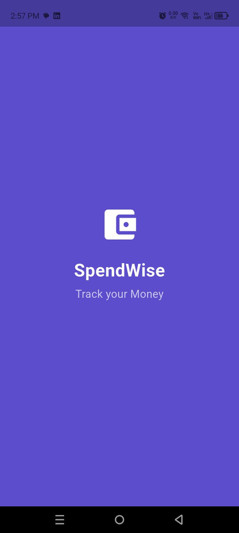
  &nbsp;
  <!--  -->
  &nbsp;
  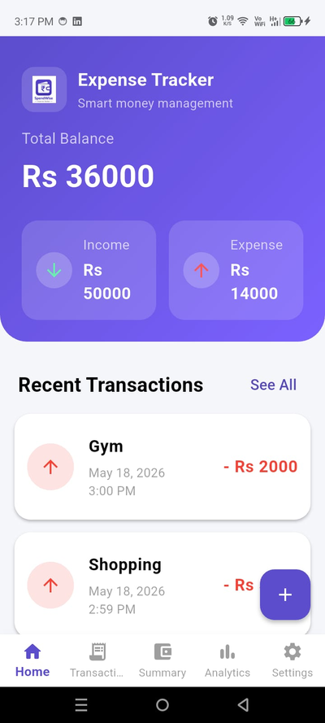
</p>

---

<h3 align="center">Transactions</h3>

<p align="center">
  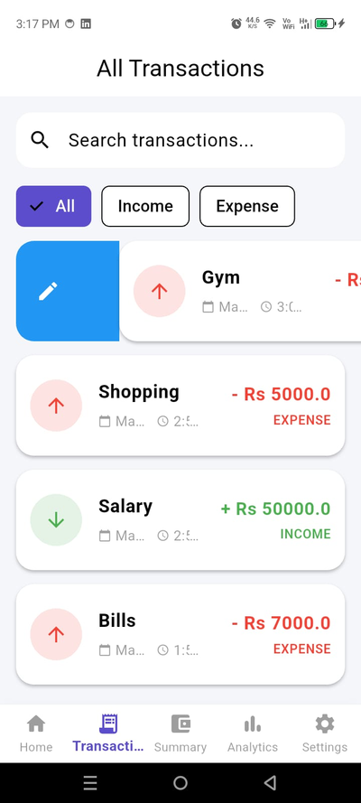
  &nbsp;
  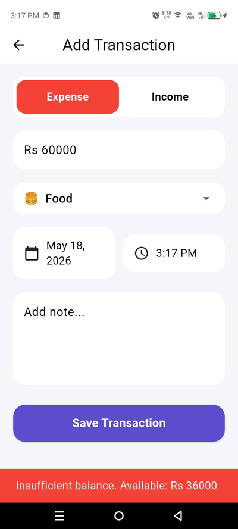
  &nbsp;
  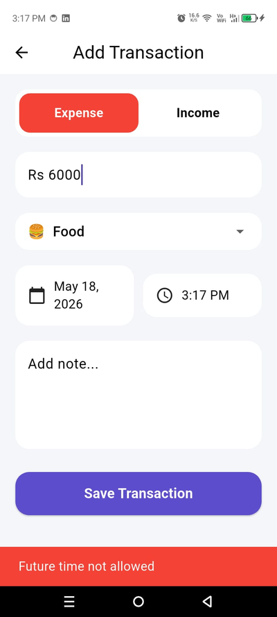
</p>

<p align="center">
  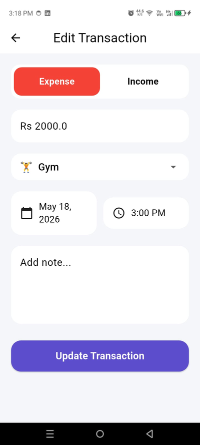
  &nbsp;
  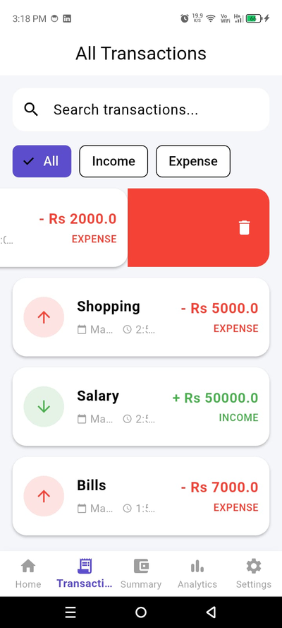
  &nbsp;
  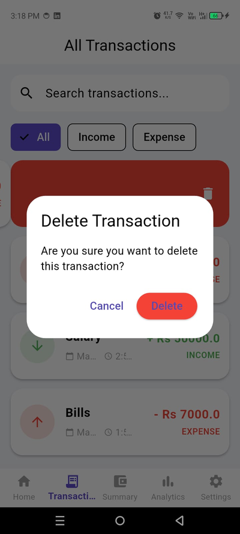
</p>

---

<h3 align="center">Analytics & Reports</h3>

<p align="center">
  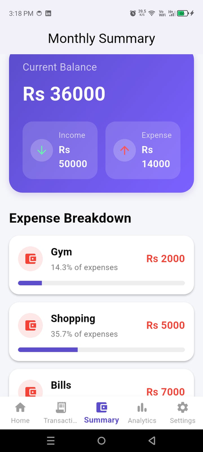
  &nbsp;
  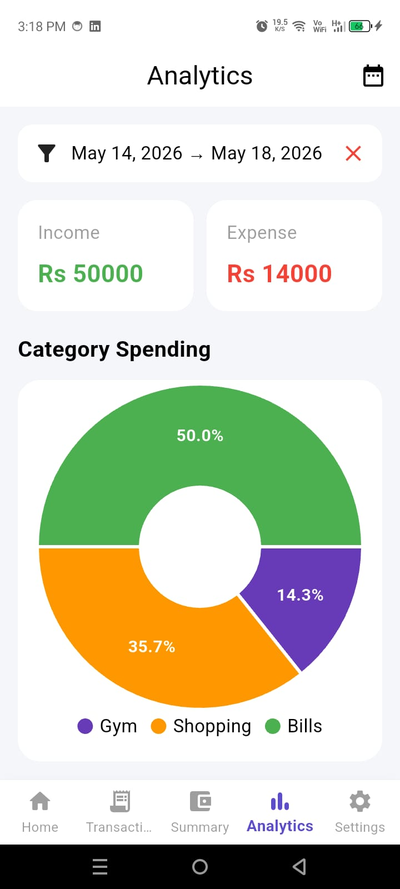
  &nbsp;
  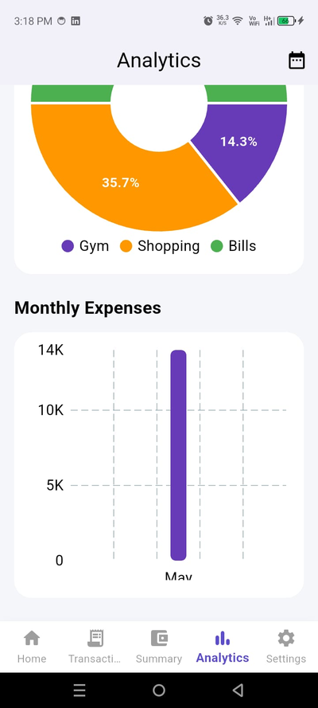
</p>

<p align="center">
  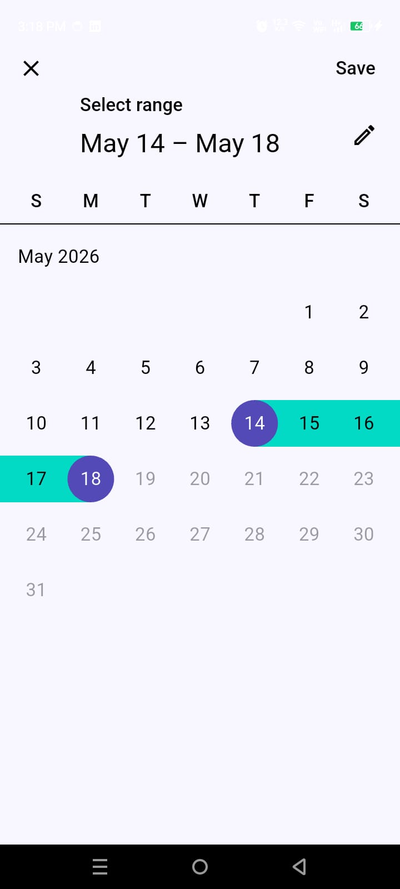
</p>

---

<h3 align="center">Categories & Settings</h3>

<p align="center">
  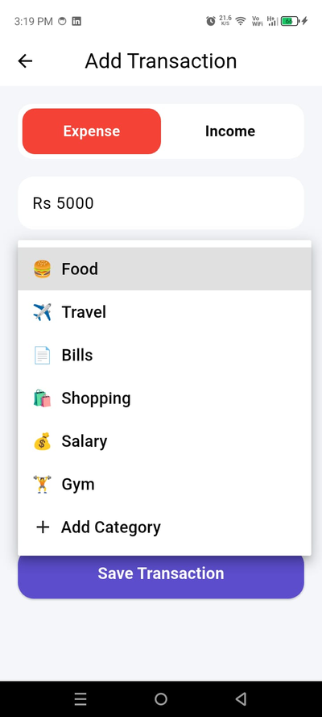
  &nbsp;
  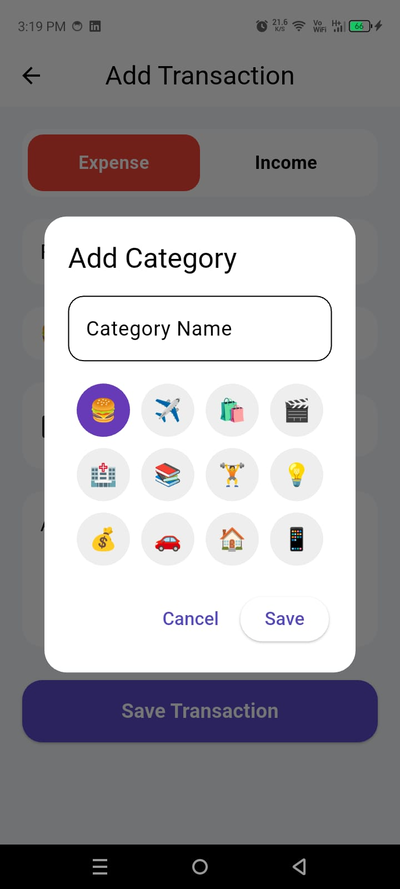
  &nbsp;
  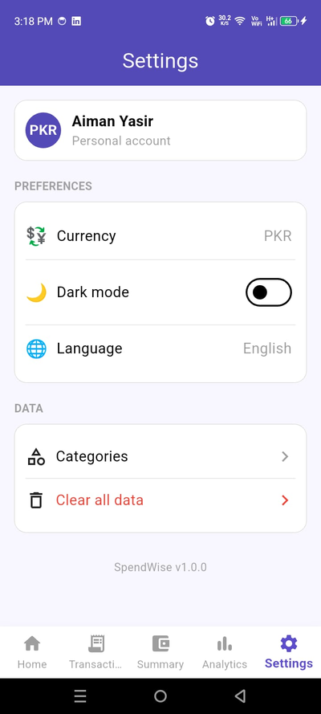
</p>

---

## ✨ Features

| Feature | Description |
|---|---|
| 💰 **Dashboard** | Total balance, income & expense summary at a glance |
| ➕ **Add Transactions** | Log income or expenses with category, date, time & optional notes |
| ✏️ **Edit & Delete** | Swipe left to delete or right to edit any transaction |
| 🔍 **Search & Filter** | Search by name; filter by All / Income / Expense |
| 📊 **Monthly Summary** | Per-category expense breakdown with visual progress bars |
| 📈 **Analytics** | Donut chart for category spending + monthly bar chart with date range filter |
| 🏷️ **Custom Categories** | Create your own categories with a choice of emoji icons |
| 🌙 **Dark Mode** | Toggle light/dark theme from Settings |
| 💱 **Currency Selection** | Choose your preferred currency (default: PKR) |
| 🛡️ **Smart Validation** | Blocks future-dated transactions and overspending beyond balance |
| 💾 **Offline First** | All data stored locally — works with zero internet connection |

---

## 🛠 Tech Stack

| Layer | Technology |
|---|---|
| Framework | Flutter 3.x |
| Language | Dart 3.x |
| State Management | Provider + ChangeNotifier |
| Local Storage | GetStorage |
| Charts | fl_chart |
| Date Formatting | intl |
| Unique IDs | uuid |

---

## 🏗 Architecture

The app follows a clean Provider-based architecture with clearly separated responsibilities:

- **`TransactionProvider`** — CRUD operations, balance & totals calculation
- **`CategoryProvider`** — Default + custom category management with local persistence
- **`SettingsProvider`** — Theme mode and currency preferences

All providers are initialized via `MultiProvider` in `main.dart`.

---

## 📂 Project Structure

```
lib/
├── main.dart                          # App entry point & MultiProvider setup
├── models/
│   ├── transaction.dart               # Transaction data model
│   └── category.dart                  # Category data model
├── providers/
│   ├── transaction_provider.dart      # Transaction state & logic
│   ├── category_provider.dart         # Category state & persistence
│   └── settings_provider.dart         # Theme & currency preferences
├── services/
│   └── storage_service.dart           # GetStorage read/write abstraction
└── screens/
    ├── splash_screen.dart
    ├── home_screen.dart
    ├── add_edit_transaction_screen.dart
    ├── all_transactions_screen.dart
    ├── monthly_summary_screen.dart
    ├── analytics_screen.dart
    ├── categories_screen.dart
    └── settings_screen.dart

assets/
├── images/                            # App logo
└── screenshots/                       # App screenshots
```

---

## 📦 Dependencies

```yaml
dependencies:
  flutter:
    sdk: flutter
  provider: ^6.1.2
  get_storage: ^2.1.1
  fl_chart: ^0.68.0
  intl: ^0.19.0
  uuid: ^4.3.3
  cupertino_icons: ^1.0.8
```

---

## 🚀 Getting Started

### Prerequisites

- Flutter SDK ≥ 3.0.0
- Android Studio or VS Code with Flutter extension
- Android emulator or physical device (Android 5.0+)

### Installation

```bash
# 1. Clone the repository
git clone https://github.com/YOUR_USERNAME/spendwise.git

# 2. Navigate to the project directory
cd spendwise

# 3. Install dependencies
flutter pub get

# 4. Run the app
flutter run
```

### Build Release APK

```bash
flutter build apk --release
# Output: build/app/outputs/flutter-apk/app-release.apk
```

---

## 🔮 Future Enhancement

- [ ] User authentication & cloud sync (Firebase)
- [ ] Budget goals & spending alerts
- [ ] Recurring / scheduled transactions
- [ ] CSV & PDF export
- [ ] Biometric app lock
- [ ] Multi-account support
- [ ] Multi-language localization

---

## 👤 Author

**Aiman Yasir |Junior Flutter Developer**

[](https://github.com/AIMAN-YASIR)

[](https://www.linkedin.com/in/aiman-yasir-b59172371)

[](mailto:aimanyasir0005@gmail.com)

---


<div align="center">

⭐ If you found this project helpful, consider giving it a star — it helps a lot!

<br/>

Made with ❤️ using Flutter

</div>